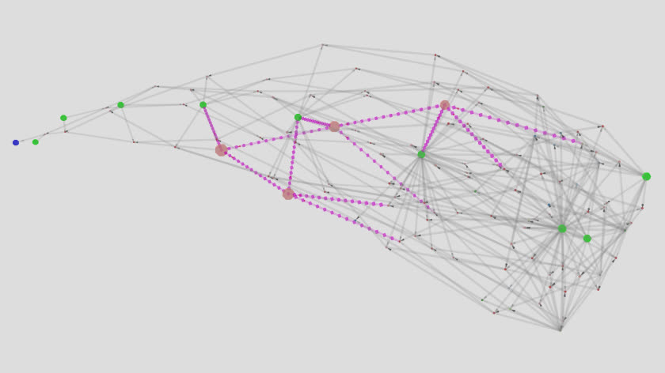

\[click on image to start the interactive model, NOTE: CPU intensive\]
[](https://rockingship.github.io/untangle-dataset/viewer/span-5n9.html)
\[A 5-node 9-variable (5n9) structure (magenta) spanning an expression.

# untangle-dataset (v1)

RockingShip proudly presents the first version of the dataset describing practical fractal space.

TL;DR

Grab file with easy URL, unpack and build

```sh
  wget https://rockingship.github.io/untangle-dataset/untangle-mixed-v1.json.xz
  xz -d untangle-mixed-v1.json.xz
  genimport untangle-mixed-v1.db untangle-mixed-v1.json
  ln -s untangle-mixed-v1.db untangle.db
```

## Manifest

  Files hosted on this page:

  - [untangle-mixed-v1.json.xz](untangle-mixed-v1.json.xz) - Import data (RECOMMENDED)  
    SIZE=3911456, MD5=d97762d0de228601fc6bdd7d85e43b5f

  - [untangle-mixed-v1.tar.xz](untangle-mixed-v1.tar.xz) - Data-list files
    SIZE=3034856, MD5=4c9f0974d902dada332484cbe3fb3776

  "mixed" allow "QTnF" and "QTF" operators, "pure" are "QnTF" only

  Other files/versions can be found on the github project page [https://github.com/RockingShip/untangle-dataset](https://github.com/RockingShip/untangle-dataset)

## Table of contents

  - [Manifest](#manifest)
  - [Table of contents](#table-of-contents)
  - [Dataset `5n9`](#dataset-5n9)
  - [Dataset `6n9-pure`](#dataset-6n9-pure)
  - [Building and Installation](#building-and-installation)
    - [Build system](#build-system)
  - [`untangle-mixed-v1.db` from list files (15 minutes)](#untangle-mixed-v1db-from-list-files-15-minutes)
    - [Section `transform`](#section-transform)
    - [Load `signature`](#load-signature)
    - [Build `swap`](#build-swap)
    - [Load `member`](#load-member)
    - [Creating data-lists](#creating-data-lists)
  - [`untangle-mixed-v1.db` from scratch](#untangle-mixed-v1db-from-scratch-2-3-hours)
    - [Section `transform` (1 minute)](#section-transform-1-minute)
    - [Section `signature` (5 minutes)](#section-signature-10-minutes)
    - [Section `swap` (1 minutes)](#section-swap-2-minutes)
    - [Section `member` (15 + 50 / gridCPU minutes)](#section-member-15--50--gridcpu-minutes)
    - [Remove `depreciated` members (30 minutes)](#remove-depreciated-members-30-minutes)
  - [Requirements](#requirements)
  - [Versioning](#versioning)
  - [License](#license)

## Dataset `5n9`

Generating the dataset from scratch takes about 80 single-core hours to construct.  
The essence is exported as a 100Mbyte JSON, compressed to 9M, which when imported and indexed will become 20G.

The dataset contains:

 - Transforms/skins (362880)

   All 9! forward and reverse permutations of the 9 variables.  
   Specifically ordered to form a directional vector.

 - Initial evaluator state, copy-on-write (1GByte)

   For evaluating trees with 9-variables, using 9! 512-bit vectors  
   Generating the initial state takes about 15 CPU seconds.  
   Using copy-on-write reduces that to near-zero.

 - Signatures (791646)

   Normalised uniqueness of all `4n9` structures.

 - Swaps (151)

   Variable/endpoint position reordering based on signature function.  
   Common situations are commutative properties of symmetrical operators.

 - Imprints (181680347)

   Associative tree lookup that determines its function (signature) and variable permutation (transform).  
   The index/data is 12Gbyte large.

 - Members (6258677)

   Instances used to detect and construct `5n9` structures.
   All members are fully interlocking (safe) and independent (diversity).  
   If a member is broken into smaller fragments, each piece would also be "safe".  
   Each member is used complete or partly as a component by other members.

## Dataset `6n9-pure`

Additionally available is the experimental dataset consisting exclusively of `QnTF` operators.

The dataset is based on `4n9` pure signatures.  
These are signatures where all nodes are exclusively `QnTF` except the top-level node that may be mixed `QnTF` or `QTF`.  
All the nodes of member structures are exclusively `QnTF`.

Just like the main dataset, members of `5n9-pure` space are used to fill blank spots of `4n9-pure` space.
Only it turns out that 3 of the 193171 signatures have missing members, requiring to search for them in `6n9-pure` space.  
The challenge is that scanning `5n9-pure` space takes 6 hours and `6n9-pure` space is 450 times larger (4.1e11 structures).

To speed things up, an intermediate dataset is created containing only the 3 incomplete signature groups.  
In addition, the lookup index is set to full-associative mode which is 720 times faster.  
A full associative index is also 720 larger which makes it only doable for tiny signature collections.
For comparison, the `5n9-pure` associative index is 4GByte.

Scanning `6n9-pure` finds 22661 candidates of which 449 are usable.

Note that when one of these three signatures are detected in the run-time input, they will be substituted with structures that are 2 nodes larger.

Using `QnTF` only structures reduces possibilities in variation resulting in more condensed structures.  
The collection consists of 31962556 members, of which ? are depreciated and ? are considered building block components.
Compared with `5n9` dataset with values 6258678, ? and ?.

## Building and Installation

There are three ways to build the database:

  - Importing (recommended)

    Very fast and import is checksum protected.

  - [Loading data lists](#untangle-mixed-v1db-from-list-files-15-minutes)

    Loading the data and re-applying validation takes about 15 minutes.  
    The advantage is that data can be tweaked, mixed or manually constructed.

  - [Building from scratch](#untangle-mixed-v1db-from-scratch-2-3-hours)

    This can take days unless there is a High-Performance-Computing grid lying around.  
    `Untangle` was build with the Sun-Grid-Engine in mind.

### Build system

`Untangle` is designed to run and build using 32bit systems fitted with 32G memory.

`Untangle` is also heavily memory I/O bound and will likely kill CPU cache.  
Effort has been done to access the evaluator and imprints in such a way to keep as much in cache as possible.

The database has been designed for grid environment where the database is hosted on a NFS share and loaded into the file system cache.  
It is accessed using `mmap()` in copy-on-write mode and has a number of fallback options.  
The database is explicitly accessed to not use swap-space or core-dump.

The current suggestion is a 64G/8-core system:
  - 4G for linux
  - 8G for applications
  - 20G filesystem cache
  - 32G (8x4G) for the workers

The idea is that the database is loaded, located and accessed in the file-system cache during the full run of a program.  
If things go slow, and `kswapd` has been spotted, then most likely too many applications are running.

The database generator programs typically open the input database using `mmap()`,  
  copy the sections being modified or created to application memory,  
  then at the very last moment open the output database with `posix_fadvise(POSIX_FADV_DONTNEED)`.

Saving a 18G database file can take between 10 seconds to several minutes, even on SSD.

## `untangle-mixed-v1.db` from list files (15 minutes)

Export lists contain the values present in the database sections.  
They are re-validated when loaded and are basically are a fast-forward without false-positives.  
The advantage is that data can be examined, mixed and even modified.

Grab and unpack one of the data-list archives.

The following paragraph contain the commands to create and load them into the database.

### Section `transform`

Create initial database containing pre-calculated mandatory sections.

```
[xyzzy@host v2.8.0]$ ./gentransform transform.db
```

### Load `signature`

Load the list with signatures into the database.  
Node size = 4.

```
[xyzzy@host v2.8.0]$ ./gensignature transform.db 4 signature.db --load=signature.lst --no-generate
```

### Build `swap`

The variabl/endpoint swap information needs to be calculated.

```
[xyzzy@host v2.8.0]$ ./genswap signature.db swap.db
```

### Load `member`

Load the list with members into the database.  
Depreciated members have already been removed from the list.  
Node size = 5.

```
[xyzzy@host v2.8.0]$ ./genmember swap.db 5 untangle-mixed-v1.db --load=member.lst --no-generate
```

### Creating data-lists

```
[xyzzy@host v2.8.0]$ ./gensignature untangle-mixed-v1.db 4 --no-generate --text=3 > signature.lst
[xyzzy@host v2.8.0]$ ./genmember untangle-mixed-v1.db 5 --no-generate --text=3 > member.lst
```

## `untangle-mixed-v1.db` from scratch (2-3 hours)

The following paragraphs contain the commands and screen logs to create the database section.

Building from scratch is a resource demanding experience.  
`Untangle` developer environment has 32x 4G SGE grid nodes at its disposal.  
On occasions, it has been extended to 128 nodes on Amazon S3.

Note that in case of storage shortage, older intermediate databases can be deleted.

### Section `transform` (1 minute)

Create initial database containing pre-calculated mandatory sections

```
[xyzzy@host v2.8.0]$ ./gentransform transform.db
[00:00:00] Allocated 0.854G memory
[00:00:00] Generated 362880 transforms
[00:00:12] Writing transform.db
[00:00:12] Written transform.db, 854025184 bytes
```

### Section `signature` (10 minutes)

Multi-pass creation of signatures, saving checkpoint data.

```
[xyzzy@host v2.8.0]$ ./gensignature transform.db 1 signature-1n9.db --text=1 >signature-1n9.ckp
[00:00:00] Rebuilding indices
[00:00:00] Indices built
[00:00:00] Generating candidates for 0n9
[00:00:01] numSlot=9 pure=0 numNode=0 interleave=504 numCandidate=0 numSignature=3(33%) numImprint=6(5%) | skipDuplicate=0
[00:00:01] Generating candidates for 1n9
[00:00:01] numSlot=9 pure=0 numNode=1 interleave=504 numCandidate=6 numSignature=9(100%) numImprint=108(96%) | skipDuplicate=0
[00:00:01] Sorting signatures
[00:00:01] Rebuilding imprints
[00:00:01] Imprints built. numImprint=108(96%) | hash=1.065
[00:00:18] Writing signature-1n9.db
[00:00:18] Written signature-1n9.db, 854036704 bytes
```

```
[xyzzy@host v2.8.0]$ ./gensignature signature-1n9.db  2 signature-2n9.db --text=1 >signature-2n9.ckp
[00:00:00] Copying signature section
[00:00:00] Copying imprint section
[00:00:00] Rebuilding indices
[00:00:00] Indices built
[00:00:00] Generating candidates for 2n9
[00:00:00] numSlot=9 pure=0 numNode=2 interleave=504 numCandidate=424 numSignature=110(96%) numImprint=6327(95%) | skipDuplicate=0
[00:00:00] Sorting signatures
[00:00:00] Rebuilding imprints
[00:00:00] Imprints built. numImprint=6309(95%) | hash=1.095
[00:00:12] Writing signature-2n9.db
[00:00:12] Written signature-2n9.db, 854669088 bytes
```

```
[xyzzy@host v2.8.0]$ ./gensignature signature-2n9.db  3 signature-3n9.db --text=1 >signature-3n9.ckp
[00:00:00] Copying signature section
[00:00:00] Copying imprint section
[00:00:00] Rebuilding indices
[00:00:00] Indices built
[00:00:00] Generating candidates for 3n9
[00:00:02] numSlot=9 pure=0 numNode=3 interleave=504 numCandidate=81406 numSignature=5666(95%) numImprint=775137(95%) | skipDuplicate=5
[00:00:02] Sorting signatures
[00:00:02] Rebuilding imprints
[00:00:02] Imprints built. numImprint=773874(95%) | hash=1.102
[00:00:15] Writing signature-3n9.db
[00:00:15] Written signature-3n9.db, 932537216 bytes
```

```
[xyzzy@host v2.8.0]$ ./gensignature signature-3n9.db  4 signature-4n9.db --text=1 >signature-4n9.ckp
[00:00:00] Copying signature section
[00:00:00] Copying imprint section
[00:00:00] Rebuilding indices
[00:00:00] Indices built
[00:00:00] Generating candidates for 4n9
[00:05:45] numSlot=9 pure=0 numNode=4 interleave=504 numCandidate=29990974 numSignature=791647(95%) numImprint=181855572(95%) | skipDuplicate=2906
[00:05:45] Sorting signatures
[00:05:48] Rebuilding imprints
[00:06:40] Imprints built. numImprint=181679064(95%) | hash=1.145
[00:06:47] Writing signature-4n9.db
[00:06:54] Written signature-4n9.db, 19252524576 bytes
```

### Section `swap` (2 minutes)

Single pass, no checkpointing.

```
[xyzzy@host v2.8.0]$ ./genswap  signature-4n9.db swap-4n9.db
[00:00:00] Rebuilding indices
[00:00:00] Indices built
[00:00:00] Generating swaps.
[00:01:47] numSwap=151(86%) | skipDuplicate=101518
[00:01:55] Writing swap-4n9.db
[00:02:01] Written swap-4n9.db, 19252534176 bytes
```

### Section `member` (15 + 50 / gridCPU minutes)

Multi-pass upto `4n9`. `5n9` is a beast and best fed to the grid.
NOTE: This section must have zero empty and unsafe members to be complete.

```
[xyzzy@host v2.8.0]$ ./genmember swap-4n9.db 1 member-1n9.db --text=1 >member-1n9.ckp
[00:00:00] Rebuilding indices
[00:00:00] Indices built
[00:00:00] numImprint=181679064(100%) numMember=1(0%) numEmpty=791646 numUnsafe=0
[00:00:00] Generating candidates for 0n9
[00:00:00] numSlot=9 pure=0 numNode=0 numCandidate=0 numMember=3(0%) numPair=1(0%) numEmpty=791644 numUnsafe=0 | skipDuplicate=0 skipSize=0 skipUnsafe=0
[00:00:00] Generating candidates for 1n9
[00:00:00] numSlot=9 pure=0 numNode=1 numCandidate=6 numMember=9(0%) numPair=5(0%) numEmpty=791638 numUnsafe=0 | skipDuplicate=0 skipSize=0 skipUnsafe=0
[00:00:00] Sorting members
[00:00:00] Indexing members
[00:00:00] Indexed members. numMember=9 skipUnsafe=0
[00:00:00] WARNING: 791638 empty and 791638 unsafe signature groups
[00:00:00] {"numSlot":9,"pure":0,"interleave":504,"numNode":1,"numImprint":181679064,"numSignature":791647,"numMember":9,"numEmpty":791638,"numUnsafe":791638,"numPair":5}
[00:00:07] Writing member-1n9.db
[00:00:14] Written member-1n9.db, 19383506336 bytes
```

```
[xyzzy@host v2.8.0]$ ./genmember member-1n9.db 2 member-2n9.db --text=1 >member-2n9.ckp
[00:00:00] Copying pair section
[00:00:00] Copying member section
[00:00:00] Rebuilding indices
[00:00:00] Indices built
[00:00:00] numImprint=181679064(100%) numMember=9(0%) numEmpty=791638 numUnsafe=0
[00:00:00] Generating candidates for 2n9
[00:00:00] numSlot=9 pure=0 numNode=2 numCandidate=424 numMember=275(0%) numPair=13(0%) numEmpty=791537 numUnsafe=0 | skipDuplicate=0 skipSize=158 skipUnsafe=0
[00:00:00] Sorting members
[00:00:00] Indexing members
[00:00:00] Indexed members. numMember=275 skipUnsafe=0
[00:00:00] WARNING: 791537 empty and 791537 unsafe signature groups
[00:00:00] {"numSlot":9,"pure":0,"interleave":504,"numNode":2,"numImprint":181679064,"numSignature":791647,"numMember":275,"numEmpty":791537,"numUnsafe":791537,"numPair":13}
[00:00:07] Writing member-2n9.db
[00:01:43] Written member-2n9.db, 19383525536 bytes
```

```
[xyzzy@host v2.8.0]$ ./genmember member-2n9.db 3 member-3n9.db --text=1 >member-3n9.ckp
[00:00:00] Copying pair section
[00:00:00] Copying member section
[00:00:01] Rebuilding indices
[00:00:01] Indices built
[00:00:01] numImprint=181679064(100%) numMember=275(0%) numEmpty=791537 numUnsafe=0
[00:00:01] Generating candidates for 3n9
[00:00:04] numSlot=9 pure=0 numNode=3 numCandidate=81406 numMember=30079(0%) numPair=377(1%) numEmpty=785981 numUnsafe=0 | skipDuplicate=173 skipSize=51060 skipUnsafe=0
[00:00:04] Sorting members
[00:00:04] Indexing members
[00:00:04] Indexed members. numMember=30079 skipUnsafe=0
[00:00:04] WARNING: 785981 empty and 785981 unsafe signature groups
[00:00:04] {"numSlot":9,"pure":0,"interleave":504,"numNode":3,"numImprint":181679064,"numSignature":791647,"numMember":30079,"numEmpty":785981,"numUnsafe":785981,"numPair":377}
[00:00:15] Writing member-3n9.db
[00:01:35] Written member-3n9.db, 19385674336 bytes
```

```
[xyzzy@host v2.8.0]$ ./genmember member-3n9.db 4 member-4n9.db --text=1 >member-4n9.ckp
[00:00:00] Copying pair section
[00:00:00] Copying member section
[00:00:00] Rebuilding indices
[00:00:00] Indices built
[00:00:00] numImprint=181679064(100%) numMember=30079(0%) numEmpty=785981 numUnsafe=0
[00:00:00] Generating candidates for 4n9
[00:03:55] numSlot=9 pure=0 numNode=4 numCandidate=29990974 numMember=6183205(95%) numPair=48967(95%) numEmpty=0 numUnsafe=32 | skipDuplicate=57940 skipSize=22827233 skipUnsafe=119522
[00:03:55] Sorting members
[00:04:21] Indexing members
[00:04:26] Indexed members. numMember=6183205 skipUnsafe=0
[00:04:26] WARNING: 0 empty and 32 unsafe signature groups
[00:04:26] {"numSlot":9,"pure":0,"interleave":504,"numNode":4,"numImprint":181679064,"numSignature":791647,"numMember":6183205,"numEmpty":0,"numUnsafe":32,"numPair":48967}
[00:04:33] Writing member-4n9.db
[00:04:40] Written member-4n9.db, 19829088128 bytes
```

There are 32 incomplete signature groups so the scanning of `5n9` space is necessary.  
Instead of dragnetting the entire space, search selectively for the missing members with a faster full associative index.  
For that we need to create a specialised database.

First get a list of incomplete signature groups.  

```
[xyzzy@host v2.8.0]$ ./genmember member-4n9.db 4 --no-generate --listunsafe >missing.lst
[xyzzy@host v2.8.0]$ wc missing.lst # should output 32
```

Then create a database with full associative lookups. This needs user supplied limits, each signature requires roughly worstcase 400000 imprints.

```
[xyzzy@host v2.8.0]$ ./gensignature transform.db 4 missing-4n9.db --load=missing.lst --no-generate --interleave=362880 --maximprint=12800000 
```

Search `5n9` space, save the checkpoints and reapply them to the main database.
This can be done either single-cpu or with the grid.

Using single-core (50 minutes):

```
[xyzzy@host v2.8.0]$ ./genmember missing-4n9.db 5 --text=1 >missing-5n9.ckp
```

Using grid with 81 jobs/tasks:

```
[xyzzy@host v2.8.0]$ mkdir log-missing-5n9
[xyzzy@host v2.8.0]$ qsub -wd $PWD -o log-missing-5n9 -e log-missing-5n9 -b y -t 1-81 -q 4G.q -ckpt check ./genmember --task=sge missing-4n9.db 5 --text=1
[xyzzy@host v2.8.0]$ grep done log-missing-5n9/genmember.e* | wc  # should output 81
[xyzzy@host v2.8.0]$ cat log-missing-5n9/genmember.o* >missing-5n9.ckp
```

If a grid is unavailable, and there is sufficient memory, then the option `--task` may give opportunity to run multi-core.

```
[xyzzy@host v2.8.0]$ ./genmember missing-4n9.db 5 --text=1 >>missing-5n9.ckp --timer=30 --task=1,4 &
[xyzzy@host v2.8.0]$ ./genmember missing-4n9.db 5 --text=1 >>missing-5n9.ckp --timer=30 --task=2,4 &
[xyzzy@host v2.8.0]$ ./genmember missing-4n9.db 5 --text=1 >>missing-5n9.ckp --timer=30 --task=3,4 &
[xyzzy@host v2.8.0]$ ./genmember missing-4n9.db 5 --text=1 >>missing-5n9.ckp --timer=30 --task=4,4 &
```

Then, finally, reapply the checkpoint data to the final step of this stage creation:

```
[xyzzy@host v2.8.0]$ ./genmember member-4n9.db 5 member-5n9.db --load=missing-5n9.ckp --no-generate --text=1 >member-5n9.ckp
[00:00:00] Copying pair section
[00:00:00] Copying member section
[00:00:00] Rebuilding indices
[00:00:01] Indices built
[00:00:01] numImprint=181679064(100%) numMember=6183205(17%) numEmpty=0 numUnsafe=32
[00:00:01] Reading members from file
[00:00:03] Read 124424 members. numSignature=791647(95%) numMember=6253958(18%) numPair=82653(4%) numEmpty=0 numUnsafe=0 | skipDuplicate=2647 skipSize=0 skipUnsafe=50970
[00:00:03] Sorting members
[00:00:17] Indexing members
[00:00:21] Indexed members. numMember=6253958 skipUnsafe=0
[00:00:21] {"numSlot":9,"pure":0,"interleave":504,"numNode":5,"numImprint":181679064,"numSignature":791647,"numMember":6253958,"numEmpty":0,"numUnsafe":0,"numPair":67925}
[00:00:32] Writing member-5n9.db
[00:02:10] Written member-5n9.db, 20459768640 bytes
```

Section complete with `numEmpty`=0 and `numUnsafe`=0.

### Remove `depreciated` members (30 minutes)

Now all signature groups are complete can they be pruned.  
Search and remove component members that do not contribute to uniqueness.  
`1n9` are root components, `2n9` are locked components, so start at `3n9`.

```
[xyzzy@host v2.8.0]$ ./gendepreciate member-5n9.db 3 depr-3n9.db --text=1 >depr-3n9.ckp
[00:00:00] Copying signature section
[00:00:00] Rebuilding indices
[00:00:00] Indices built
[00:00:00] numMember=6253958(95%) numEmpty=0 numUnsafe=0
[00:00:01] numComponent=109080 numDepr=0 numLocked=303776
[00:00:10] numComponent=98109 numDepr=871782 numLocked=307154 | cntDepr=72 cntLock=36
[00:00:10] numComponent=98109 numDepr=871782 numLocked=307154
[00:00:21] Writing depr-3n9.db
[00:00:47] Written depr-3n9.db, 19878516928 bytes
```

```
[xyzzy@host v2.8.0]$ ./gendepreciate depr-3n9.db 4 depr-4n9.db --text=1 >depr-4n9.ckp
[00:00:00] Copying signature section
[00:00:00] Rebuilding indices
[00:00:01] Indices built
[00:00:01] numMember=5382176(95%) numEmpty=0 numUnsafe=0
[00:00:02] numComponent=95999 numDepr=0 numLocked=307154
[00:10:21] numComponent=73185 numDepr=1649868 numLocked=331359 | cntDepr=8433 cntLock=2224
[00:10:22] numComponent=73185 numDepr=1649868 numLocked=331359
[00:10:28] Writing depr-4n9.db
[00:10:35] Written depr-4n9.db, 19797364800 bytes
```

```
[xyzzy@host v2.8.0]$ ./gendepreciate depr-4n9.db 5 depr-5n9.db --text=1 >depr-5n9.ckp
[00:00:00] Copying signature section
[00:00:07] Rebuilding indices
[00:00:08] Indices built
[00:00:08] numMember=3732308(95%) numEmpty=0 numUnsafe=0
[00:00:08] numComponent=66856 numDepr=0 numLocked=331359
[00:00:08] 4(  2/s) 0.00886% eta=6:16:07 | numComponent=66852 numDepr=121 | cntDepr=4 cntLock=0 | refcnt=25 mid=86306 fab>ebcd!^!
[00:00:09] 7(  2/s) 0.01551% eta=6:16:05 | numComponent=66849 numDepr=199 | cntDepr=7 cntLock=0 | refcnt=23 mid=89084 fdabc!^ea>!
[00:00:09] 13(  4/s) 0.02880% eta=3:08:01 | numComponent=66843 numDepr=343 | cntDepr=13 cntLock=0 | refcnt=22 mid=89052 fdabc!^ae+!
[00:00:09] 21(  6/s) 0.04652% eta=2:05:19 | numComponent=66835 numDepr=527 | cntDepr=21 cntLock=0 | refcnt=21 mid=678938 babc!fade!^!
[00:00:09] 42( 10/s) 0.09305% eta=1:15:09 | numComponent=66814 numDepr=989 | cntDepr=42 cntLock=0 | refcnt=20 mid=523598 cdab^?fce>?
[00:00:09] 57( 12/s) 0.12628% eta=1:02:36 | numComponent=66799 numDepr=1304 | cntDepr=57 cntLock=0 | refcnt=19 mid=95139 fcab^d!ce+!
[00:00:09] 59(  8/s) 0.13071% eta=1:33:54 | numComponent=66797 numDepr=1344 | cntDepr=59 cntLock=0 | refcnt=18 mid=86622 fab>bcd^e!!
[00:00:09] 79( 12/s) 0.17502% eta=1:02:34 | numComponent=66777 numDepr=1724 | cntDepr=79 cntLock=0 | refcnt=17 mid=284960 fdabc!^ae+?
[00:00:09] 87( 11/s) 0.19274% eta=1:08:15 | numComponent=66769 numDepr=1868 | cntDepr=87 cntLock=0 | refcnt=16 mid=111743 abc!ade!e21!!
[00:00:09] 123( 17/s) 0.27250% eta=0:44:07 | numComponent=66733 numDepr=2480 | cntDepr=123 cntLock=0 | refcnt=15 mid=178010 fcdab^!ce&!
[00:00:10] 139( 13/s) 0.30794% eta=0:57:41 | numComponent=66721 numDepr=2672 | cntDepr=135 cntLock=4 | refcnt=14 mid=225704 cdab^!fce&!
[00:00:13] 215( 19/s) 0.47632% eta=0:39:24 | numComponent=66653 numDepr=3660 | cntDepr=203 cntLock=12 | refcnt=13 mid=90194 babc!ead>^!
[00:00:15] 293( 21/s) 0.64912% eta=0:35:35 | numComponent=66581 numDepr=4627 | cntDepr=275 cntLock=18 | refcnt=12 mid=85346 fab+eacd!^!
[00:00:17] 476( 29/s) 1.05454% eta=0:25:40 | numComponent=66406 numDepr=6851 | cntDepr=450 cntLock=26 | refcnt=11 mid=89657 ceabc!de!^3!
[00:00:20] 622( 31/s) 1.37800% eta=0:23:56 | numComponent=66268 numDepr=8359 | cntDepr=588 cntLock=34 | refcnt=10 mid=19232 ebdab>c1^!!
[00:00:23] 988( 52/s) 2.18884% eta=0:14:09 | numComponent=65910 numDepr=11753 | cntDepr=946 cntLock=42 | refcnt=9 mid=19222 ecab>c1d!^!
[00:00:27] 1288( 55/s) 2.85347% eta=0:13:17 | numComponent=65621 numDepr=14056 | cntDepr=1235 cntLock=53 | refcnt=8 mid=19199 edab+cd>^!
[00:00:33] 1903( 75/s) 4.21596% eta=0:09:36 | numComponent=65020 numDepr=18078 | cntDepr=1836 cntLock=67 | refcnt=7 mid=20059 bedabc!>^3!
[00:00:53] 2505( 31/s) 5.54965% eta=0:22:55 | numComponent=64478 numDepr=21143 | cntDepr=2378 cntLock=127 | refcnt=6 mid=19197 ebab+cd>^!
[00:01:22] 3822( 43/s) 8.46737% eta=0:16:00 | numComponent=63251 numDepr=25905 | cntDepr=3605 cntLock=217 | refcnt=5 mid=19236 ebdcab+^2!!
[00:01:51] 5014( 43/s) 11.10816% eta=0:15:33 | numComponent=62149 numDepr=29435 | cntDepr=4707 cntLock=307 | refcnt=4 mid=20069 ceabc!d>^3!
[00:02:58] 8196( 45/s) 18.15765% eta=0:13:40 | numComponent=59179 numDepr=36247 | cntDepr=7677 cntLock=519 | refcnt=3 mid=19209 ecab>cd>^!
[00:04:25] 11544( 28/s) 25.57490% eta=0:19:59 | numComponent=56098 numDepr=42189 | cntDepr=10758 cntLock=786 | refcnt=2 mid=19239 eadcab>^2!!
[00:08:49] 24605( 41/s) 54.51061% eta=0:08:20 | numComponent=43879 numDepr=60766 | cntDepr=22977 cntLock=1628 | refcnt=1 mid=18447 ab+eacd!+^
[00:17:33] numComponent=25102 numDepr=80933 numLocked=336892 | cntDepr=41754 cntLock=3384
[00:17:34] numComponent=25102 numDepr=80933 numLocked=336892
[00:17:45] Writing depr-5n9.db
[00:19:21] Written depr-5n9.db, 19643797344 bytes
```

### Export and compress

Last step is to export the database (19.6GByte) into readable text/json (103MByte) and compress with `xz` (3.9MByte).

```
[xyzzy@host v2.8.0]$ ./genexport untangle-mixed-v1.json depr-5n9.db
[xyzzy@host v2.8.0]$ xz untangle-mixed-v1.json
```

## Requirements

  * Working `untangle` environment. [https://github.com/RockingShip/untangle](https://github.com/RockingShip/untangle)
  * 32G memory minimum.
  * Suggested: 64G with 8-core CPU.
  * Suggested: fast DDR using four banks
  * 512G SSD minimum.
  * Sun Grid Engine, when building from scratch.
  * Star Cluster, for running SGE within Amazon S3.

## Versioning

We use [SemVer](http://semver.org/) for versioning. For the versions available, see the [tags on this repository](https://github.com/RockingShip/untangle-dataset/tags).

## License

This project is licensed under the GNU AFFERO General Public License v3 - see the [LICENSE.txt](LICENSE.txt) file for details
